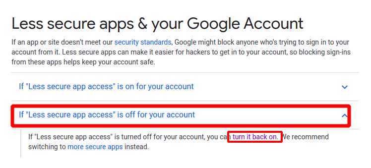
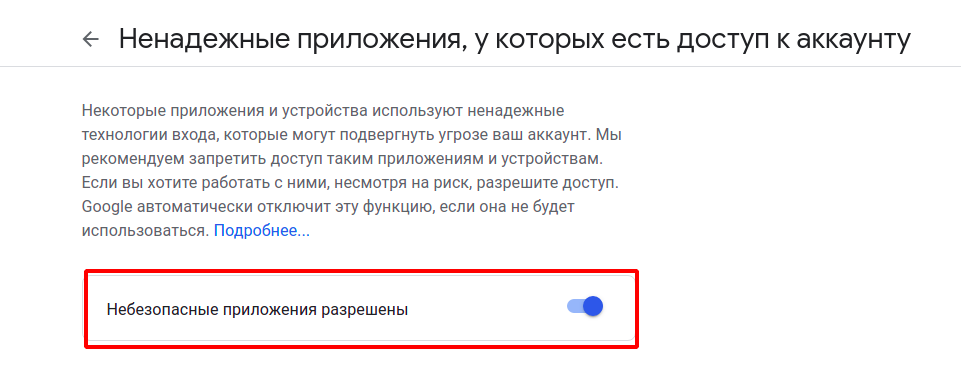
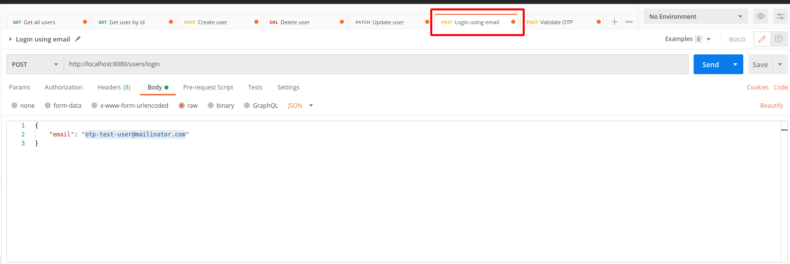
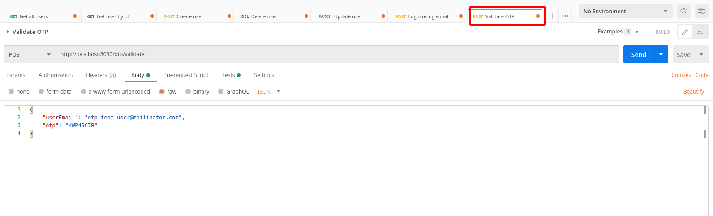
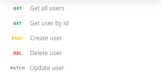

Clone the repository: 
```
git clone git@github.com:mosiichuk/otp.git
```

# Launch instructions
1) Run script to create Docker image: 
```
./docker-build.sh
```

2) Start Docker container. You should provide values to variables `SMTP_USER_NAME` and `SMTP_USER_PASSWORD`, it should be your google account credentials. So the app has possibility to send the emails. Also, please enable in google account less secure apps (Instruction https://support.google.com/accounts/answer/6010255?hl=en#zippy=%2Cif-less-secure-app-access-is-off-for-your-account)




```
docker run -p 8080:8080 -e SMTP_USER_NAME= -e SMTP_USER_PASSWORD= otp/otp
```

3) Import Postman collection `otp.postman_collection.json` and environment `otp.postman_collection.json` from the root of the project. Set `otp` environment as active in Postman.

4) To login via email use this endpoint . There is already test user to use: otp-test-user@mailinator.com. Use this link to open users mail https://www.mailinator.com/v4/public/inboxes.jsp?msgid=otp-test-user-1614763029-697303&to=otp-test-user.

5) To authenticate via email and otp use this endpoint:



After successful response in Postman test it will be automatically retrieved token from response header and set up as environment variable and used to access Users endpoints.
   
6) Then use any of Users endpoints:


